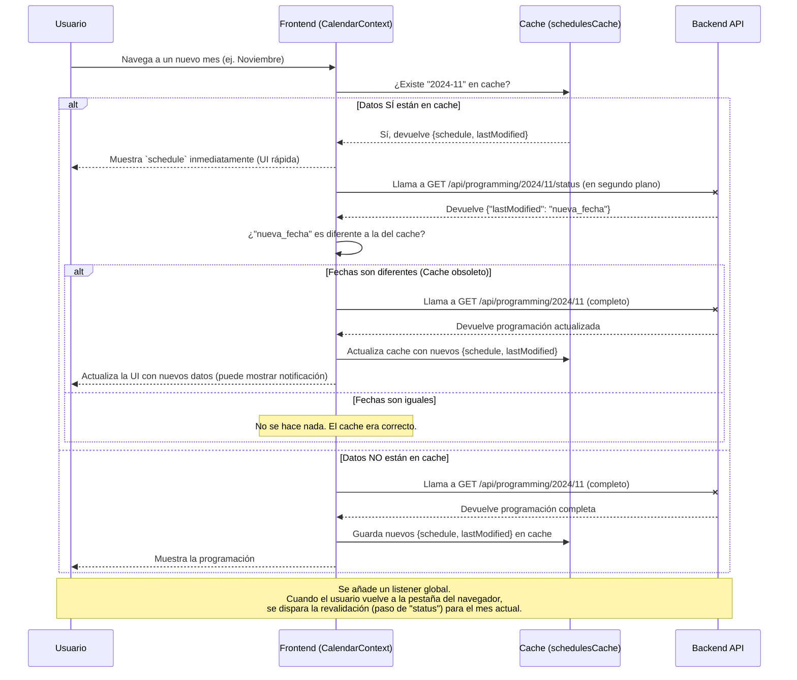

# Diseño de Estrategia de Revalidación de Cache

Este documento describe la arquitectura para mantener los datos de la programación actualizados entre diferentes usuarios y sesiones, resolviendo el problema de la desactualización del cache.

Se implementará la estrategia **"Stale-While-Revalidate" (Obsoleto-Mientras-Revalida)**.

---

### Diagrama de Flujo de la Lógica



---

### Implementación Técnica

#### 1. Backend

-   **Nuevo Endpoint:** `GET /api/programming/:year/:month/status`
    -   **Controlador:** Creará una nueva función `getProgrammingStatus`.
    -   **Lógica:** Consultará la base de datos usando `findOne({ year, month })` pero seleccionando únicamente el campo `lastModified` con `.select('lastModified')`.
    -   **Respuesta Exitosa (200 OK):**
        ```json
        { "lastModified": "2023-11-20T10:00:00.000Z" }
        ```
    -   **Respuesta Si No Existe (404 Not Found):**
        ```json
        { "lastModified": null }
        ```

#### 2. Frontend

-   **Servicio (`programmingService.js`):**
    -   Se añadirá una nueva función `getProgrammingStatus(year, month)` que haga `fetch` al nuevo endpoint `/status`.

-   **Contexto (`CalendarContext.js`):**
    -   **Modificación del Cache:** El estado `schedulesCache` ya no guardará solo el objeto del calendario. Guardará un objeto con dos propiedades:
        ```javascript
        {
          schedule: { /* ...el calendario... */ },
          lastModified: "2023-11-20T10:00:00.000Z" 
        }
        ```
    -   **Actualización de `loadProgramming`:** Se modificará para seguir el diagrama de flujo descrito arriba (mostrar cache primero, luego revalidar en segundo plano).
    -   **Nuevo `useEffect` para Revalidación en Foco:**
        -   Se creará un `useEffect` que se ejecuta una sola vez al montar el componente.
        -   Dentro, se añadirá un *event listener* a `window` para el evento `focus`.
        -   La función del *listener* comprobará la fecha de modificación del mes *actualmente visible* usando `getProgrammingStatus` y, si es necesario, disparará la actualización de los datos.

Con este diseño, logramos el objetivo: la interfaz se siente instantánea para el usuario, pero los datos se mantienen frescos y consistentes de forma automática e inteligente.
